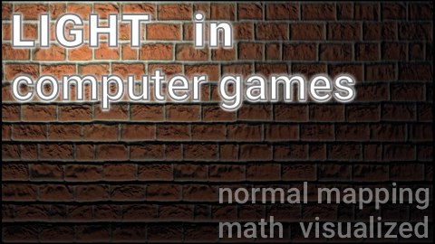

# normal-mapping-demonstration
The demonstration of per-pixel lighting in 2d space using normal maps.

See 3 mins youtube introduction.

The script
========================================
This video is about Normal Mapping technique principle.

Normal Mapping is the lighting model that's often used in computer games to make a graphics more realistic and detailed. Normal mapping is - a fast technique that gives any surface a feel of a relief and this is a pleasure for any gamer.

On the video, you can see surfaces with and without a normal mapping technique.

But what's the difference between these two different fragments and why do we see the more detailed relief on the second one? That's easy: on the second one, we can see shadows that change their position when the light moves.

The first fragment doesn't have shadows of the microrelief. !!!^^So we need to create shadows!

On black and white abstractions you can see that you don't need any color information to feel a relief, but only calculate a brightness of the pixel. So let's discuss it. Let's suppose that a brightness of the pixel is a number between 0 and 1. 0 - for a black pixel and 1 - for white. 0.5 - for a gray one and so on.

Imagine that a vector in a space with coordinates x, y and z can be represented as a pixel with red, green, and blue components accordingly.

The pixel brightness is a result of scalar multiplication between the vector of the surface normal and a vector that points from pixel to the light.

Let's have a look. This is a vector field of normals of the flat surface of a monitor. This is a blue surface. Because our vector of normal is just a Z-axis vector so each pixel is blue.

Now let's visualize a vector field where each vector starts at a pixel and look at the light source.

And now let's take a look at a result of scalar multiplication of the normal vector and the light direction vector.

It looks like a real light! :-)

But what would be if instead of a just blue field of normal vectors we'll use precalculated normal vectors that we put into an image?

Let's take a look on scalar multiplication between our vector field of pseudonormals and direction to the light?

Wow! It looks like the desired result! It looks like a real surface with real light.

Now let's add a color. We multiply RGB-vector of color we read from a texture file on our brightness value.

====
Yes! That is how actually Normal Mapping technique works. All computer graphics effects visualization you can see here are done in real-time on my Android phone I just recorded it. The source code you can find in the link below the video. The source code contains the code of all shaders and textures I used to make this video. Feel free to ask your questions and I hope there will be somebody who is able to answer them.

Thanks for your attention!

Credits
========================================
Music:
FoolBoy Media (Facebook.com/FoolBoyMedia)
FoolBoy Media - Sky Loop
https://freesound.org/people/FoolBoyMedia/sounds/264295/

FoolBoy Media - Game Show Theme Tune
https://freesound.org/people/FoolBoyMedia/sounds/220754/

Tristan_Lohengrin - 8bit Introduction
https://freesound.org/people/Tristan_Lohengrin/sounds/273539/

Sound effects:
https://freesound.org/people/LittleRobotSoundFactory/sounds/274182/

Textures are from opengameart:
https://opengameart.org/content/50-free-textures-4-normalmaps

The source code
========================================
https://github.com/egslava/normal-mapping-demonstration
